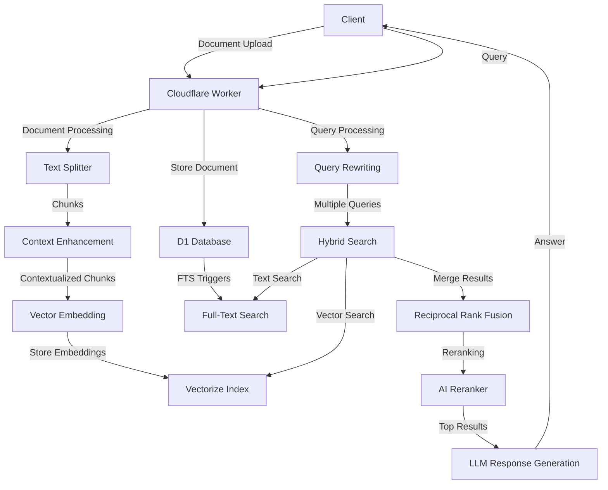

# Contextual RAG

Reference code for the blog post: [Contextual Retrieval-Augmented Generation on Cloudflare Workers](https://boristane.com/blog/contextual-rag)

An implementation of contextual retrieval augmented generation on Cloudflare Workers, providing enhanced search and AI-powered document retrieval.

## Table of Contents
- [Overview](#overview)
- [Features](#features)
- [Setup](#setup)
- [Usage](#usage)
- [Architecture](#architecture)

## Overview
This project demonstrates how to build a lightweight contextual RAG system fully on Cloudflare Workers using D1 (SQLite), Vectorize, and Workers AI. It improves search retrieval by generating contextualized chunks and reranking results using fusion techniques.

## Features
- **Contextual Document Chunking**: Documents are split into chunks and enhanced with contextual information
- **Hybrid Search**: Combines vector similarity search and full-text search for optimal results
- **Reciprocal Rank Fusion**: Merges results from different search methods for better relevance
- **Query Rewriting**: AI-powered query expansion to improve search recall
- **AI-Enhanced Responses**: Uses LLMs to generate answers based on retrieved context
- **Full TypeScript Support**: Type-safe development with TypeScript
- **Cloudflare Workers Compatibility**: Built to run on Cloudflare's edge network
- **SQLite with D1**: Uses Cloudflare D1 and Drizzle ORM for database operations
- **Vector Search**: Leverages Cloudflare Vectorize for efficient vector similarity search

## Setup
1. Install dependencies:
   ```bash
   npm install
   ```

2. Set up Cloudflare resources:
   ```bash
   ./bootstrap.sh
   ```
   This script will:
   - Create a Vectorize index for embeddings storage
   - Create a metadata index for timestamp-based filtering
   - Set up a D1 database for document storage

3. Configure your database ID in `drizzle.config.ts` and `wrangler.json`

4. Generate the initial database migration:
   ```bash
   npm run drizzle:generate
   ```

5. Copy the contents of `fts5.sql` (without the top comment) into the `.sql` migration file drizzle generates.

6. Run the migration
```bash
npm run drizzle:migrate
```

5. Deploy to Cloudflare:
   ```bash
   npm run deploy
   ```

### NPM Scripts
- **drizzle:generate**: Generates SQL migration files based on schema changes
- **drizzle:migrate**: Applies migrations to the database
- **drizzle:studio**: Opens Drizzle Studio for database management
- **deploy**: Deploys the application to Cloudflare Workers
- **dev**: Starts the application in development mode
- **start**: Alias for development mode

## Usage
Once deployed, you can interact with the API as follows:

### API Endpoints

- **POST /** - Store a new document
  - **Request Body**: `{ "contents": "Your document text here" }`
  - **Response**: Returns the created document with its ID
  - **Curl Command**:
    ```bash
    curl -X POST https://contextual-rag.<account-name>.workers.dev/ \
      -H "Content-Type: application/json" \
      -d '{"contents":"This is a sample document that will be chunked, contextualized and stored for retrieval."}'
    ```

- **POST /query** - Query documents with AI-enhanced responses
  - **Request Body**: `{ "prompt": "Your question here", "timeframe": { "from": timestamp, "to": timestamp } }`
  - **Response**: Returns matched chunks, documents, keywords, generated queries, and an AI-generated answer
  - **Curl Command**:
    ```bash
    curl -X POST https://contextual-rag.<account-name>.workers.dev/query \
      -H "Content-Type: application/json" \
      -d '{"prompt":"What are the key features of this system?", "timeframe": { "from": 1714608000000 }}'
    ```

## Architecture
Contextual-RAG combines multiple retrieval methods with AI-powered context enhancement to provide more relevant search results and answers.

### System Diagram


### Key Components
- **Text Splitter**: Divides documents into manageable chunks using RecursiveCharacterTextSplitter
- **Context Enhancer**: Uses AI to add contextual information to each chunk
- **Vector Embeddings**: Creates embeddings using Cloudflare AI
- **Query Rewriter**: Transforms user queries into multiple search queries
- **Hybrid Search**: Combines vector search and full-text search
- **Reciprocal Rank Fusion**: Merges and ranks results from different search methods
- **D1 Database**: Stores documents and chunks with full-text search capabilities
- **Cloudflare Vectorize**: Manages vector embeddings for similarity search
- **AI Models**: Provides embeddings, reranking, and answer generation
