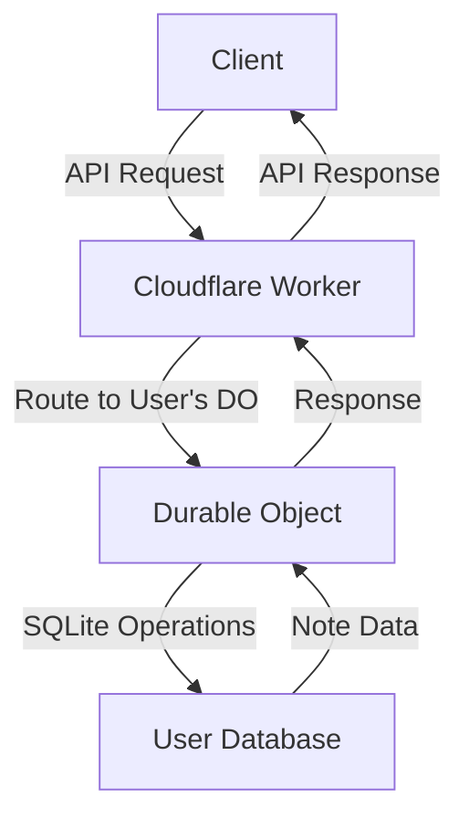

# Durable Objects Database Per User

Reference code for the blog post: [Cloudflare Workers 101: One Database Per User with Cloudflare Durable Objects and Drizzle ORM](https://boristane.com/blog/durable-objects-database-per-user)

A Cloudflare Workers application that demonstrates how to create isolated databases for each user using Durable Objects and Drizzle ORM.

## Table of Contents
- [Overview](#overview)
- [Features](#features)
- [Setup](#setup)
- [Usage](#usage)
- [Architecture](#architecture)

## Overview
This project showcases a powerful pattern for multi-tenant applications on Cloudflare Workers: creating one SQLite database per user with Durable Objects. By leveraging Drizzle ORM, we get type-safe database operations while maintaining complete isolation between users' data stores.

## Features
- **Isolated User Databases**: Each user gets their own SQLite database
- **Type-safe ORM**: Uses Drizzle ORM for database operations
- **Automatic Migrations**: Database schema is managed through Drizzle migrations
- **RESTful API**: Simple API for interacting with user notes
- **TypeScript Support**: Full type safety throughout the codebase

## Setup
1. Install dependencies:
   ```bash
   npm install
   ```

2. Generate the initial database migration:
   ```bash
   npm run drizzle:generate
   ```

3. Deploy to Cloudflare:
   ```bash
   npm run deploy
   ```

### NPM Scripts
- **drizzle:generate**: Generates SQL migration files based on schema changes
- **deploy**: Deploys the application to Cloudflare Workers
- **dev**: Starts the application in development mode
- **start**: Alias for development mode

## Usage
Once deployed, you can interact with the API to create and manage notes for different users.

### API Endpoints

- **POST /:userId**: Creates a new note for a user
  - **Request**: `{ "text": "Note content" }`
  - **Response**: `{ "note": { "id": "note_xyz", "text": "Note content", ... } }`
  - **Curl Command**:
    ```bash
    curl -X POST https://durable-objects-database-per-user.<account-name>.workers.dev/john \
      -H "Content-Type: application/json" \
      -d '{"text":"Buy groceries"}'
      
    # Response:
    # {
    #   "note": {
    #     "id": "note_jxqegmbonzvdstpy",
    #     "text": "Buy groceries",
    #     "created": "2025-03-23T15:42:18.760Z",
    #     "updated": "2025-03-23T15:42:18.760Z"
    #   }
    # }
    ```

- **GET /:userId**: Retrieves all notes for a user
  - **Response**: `{ "notes": [ ... ] }`
  - **Curl Command**:
    ```bash
    curl https://durable-objects-database-per-user.<account-name>.workers.dev/john
    
    # Response:
    # {
    #   "notes": [
    #     {
    #       "id": "note_jxqegmbonzvdstpy",
    #       "text": "Buy groceries",
    #       "created": "2025-03-23T15:42:18.760Z",
    #       "updated": "2025-03-23T15:42:18.760Z"
    #     }
    #   ]
    # }
    ```

- **GET /:userId/:noteId**: Retrieves a specific note for a user
  - **Response**: `{ "note": { ... } }`
  - **Curl Command**:
    ```bash
    curl https://durable-objects-database-per-user.<account-name>.workers.dev/john/note_jxqegmbonzvdstpy
    ```

- **DELETE /:userId/:noteId**: Deletes a specific note for a user
  - **Response**: `{ "note": { ... } }`
  - **Curl Command**:
    ```bash
    curl -X DELETE https://durable-objects-database-per-user.<account-name>.workers.dev/john/note_jxqegmbonzvdstpy
    ```

## Architecture
The application uses Cloudflare Workers with Durable Objects to provide isolated SQLite databases for each user. The Hono framework handles routing, while Drizzle ORM manages database operations.

### System Diagram


### Key Components
- **Hono Router**: Handles API requests and routes them to the appropriate Durable Object
- **Durable Objects**: Maintains state and SQLite database for a specific user
- **Drizzle ORM**: Provides type-safe database operations
